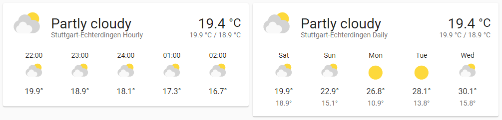
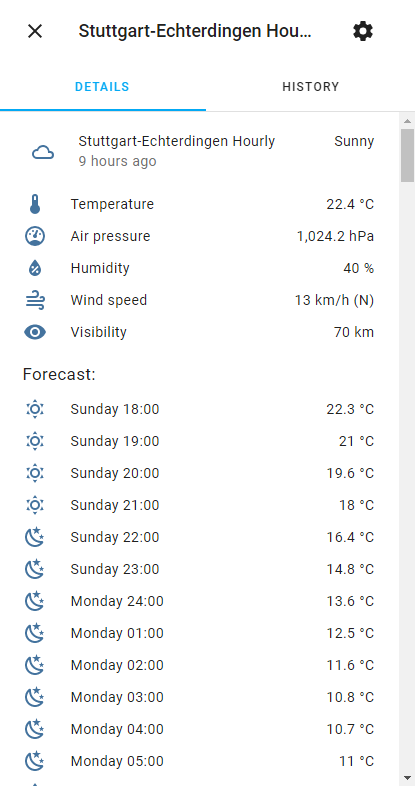
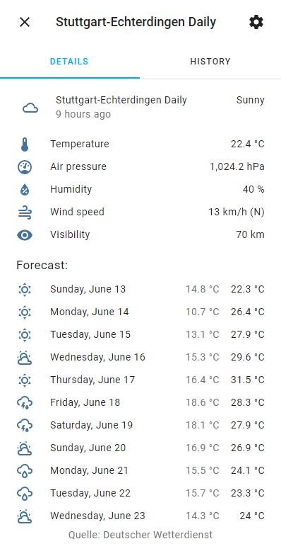
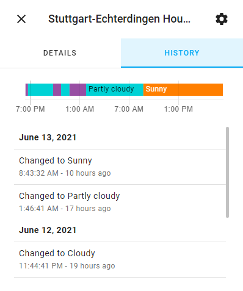
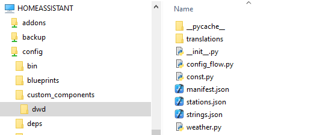
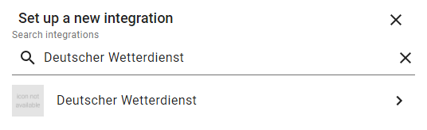
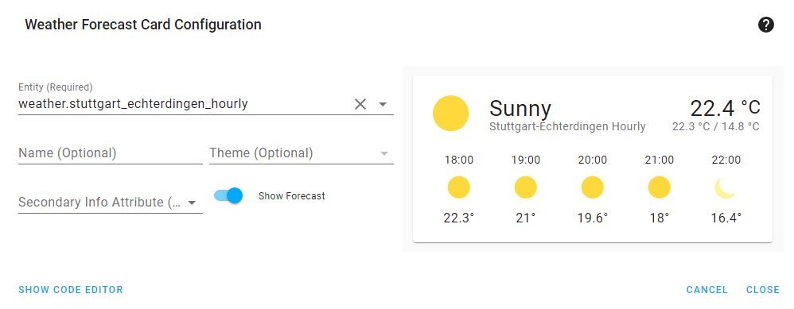
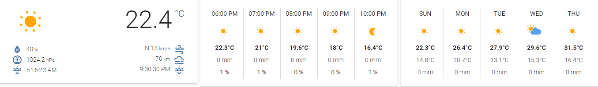

# Deutscher Wetterdienst (DWD) Integration for Home Assistant

- [Introduction](#introduction)
- [Main Features](#main-features)
- [Installation and Configuration](#installation-and-configuration)
- [Limitations and Known Issues](#limitations-and-known-issues)
- [Bug Reports](#bug-reports)
- [References](#references)

## Introduction
This custom component for [Home Assistant](https://www.home-assistant.io/) integrates weather data from the [Deutscher Wetterdienst Open Data](https://www.dwd.de/DE/leistungen/opendata/opendata.html) server into Home Assistant via weather entities.

### Legal Information

**Deutscher Wetterdienst (DWD) is not affiliated in any way with this project.**

The conditions from Deutscher Wetterdienst (DWD) for using their data and accessing their servers apply.
- https://www.dwd.de/EN/service/copyright/copyright_artikel.html
- https://opendata.dwd.de/README.txt

[stations.md](stations.md) and [dwd/stations.json](dwd/stations.json) are generated from data from Deutscher Wetterdienst (DWD) with the Python script at [tools/generate_stations/generate_stations.py](tools/generate_stations/generate_stations.py).

## Main Features

- Current measurement data from the weather stations from https://opendata.dwd.de/weather/weather_reports/poi/ as state attributes of a weather entity.
  - condition
  - temperature
  - humidity
  - pressure
  - wind_bearing
  - wind_speed
  - visibility
- Hourly forecast data from the weather stations from https://opendata.dwd.de/weather/local_forecasts/mos/MOSMIX_L/single_stations/ in the forecast list of a weather entity.
  - datetime
  - condition
  - temperature
  - cloud_cover
  - precipitation
  - precipitation_probability
  - wind_bearing
  - wind_speed
- Daily forecast data calculated by the component from the hourly forecast data. This is the most tricky part. I have compared the result of this with what the official Warnwetter app displays and the results seems to be very close.
  - datetime
  - condition
  - temperature (the maximum temperature for the day)
  - templow (the minimum temperature for the day)
  - cloud_cover
  - precipitation
- Uses the [HTTP ETag](https://en.wikipedia.org/wiki/HTTP_ETag) mechanism to only download new data if the data has changed. This allows more frequent polling (currently about every 10 minutes) while still keeping the load low.
- Configuration via UI

 

Please notice that as usual, the "9 hours ago" in the screenshot refers to the last change of the state value of the entity, in this case when it changes from "Party Cloudy" to "Sunny". Of course the values are updated much more often, but that's not reflected there. This has nothing to do with this integration but this is how it generally works, because only the state value is currently reflected in the entity history.

## Installation and Configuration

If you have access to your config folder of Home Assistant (e.g. if you have the Samba share add-on installed in Supervisor), the installation is quite easy:

1. Create a folder named "custom_components" within the config folder, if it doesn't already exist.
2. Optional: If you have Python installed and if you like, you may run [tools/generate_stations/generate_stations.py](tools/generate_stations/generate_stations.py) to update the station list. However, it shouldn't change too often, that's why it is "pre-compiled".
3. Copy the whole dwd folder of this repository into the custom_components folder. I.e. your structure should in the end be /config/custom_components/dwd.

4. Restart Home Assistant. If you see a warning "You are using a custom integration dwd which has not been tested by Home Assistant." (and no errors of course) in the log, everything went well.

To add the actual weather entities, just add a new instance of the "Deutscher Wetterdienst" integration in the Home Assistant configuration menu:

1. Open "Configuration" from the main menu.
2. Open "Integrations" from the main menu.
3. Select "Add Integration"
4. Search for "Deutscher Wetterdienst" and open it.

5. Read the instructions, change the name and station ID if needed, and select "Submit".

After that, you should have two new weather entities, one with hourly forecast and one with daily forceast. Both have the same measurement data. You may repeat these steps if you want to add more stations.

You may use these entities will any component that supports weather entities, e.g. the standard Weather Forecast Card:

I can really recommend the custom weather card at https://github.com/bramkragten/weather-card, I started using that a long time ago, because it allows more customizations than the standard weather forecast card:

## Limitations and Known Issues
- This component has no icon in the integrations list yet, because there is no brand image in the brands repository (https://github.com/home-assistant/brands) yet.
- This component only creates weather entities, no sensors. The main reason is that I didn't need it. ;) However, I also believe that this is actually the correct design, because all data is available via the weather entity. Additionally adding sensors with the same data to me seems like a workaround for limitations that are actually somewhere else.
- The daily forecast only takes the future into account, which is a deviation from how e.g. the Warnwetter app behaves. There are two reasons for that:
  - This was the easier and straight forward way during implementation. ;)
  - From a user perspective, I find it quite useful that in a *forecast*, I only see what's coming up, not what happend already. For example, if it rained the whole morning and the sun is going to shine the whole afternoon, and it's already afternoon, it's more useful to see the sun icon and not the rain oder mixed icon to know what's coming up. If you are going to create a pull request to change this behavior, please add a configuration option in the user interface to allow the user to use the current behavior.
- While this integration should follow the Home Assistant guidelines in most aspects, it doesn't in one aspect: It fetches the data directly from Deutscher Wetterdienst Open Data server instead of outsoucing the corresponding logic to a 3rd party component. This is probably also the main show-stopper for integrating this component directly into Home Assistant. Although I am a big fan of reuse and I understand the motivation, here is why I still haven't done it (yet):
  - I didn't know about this point when I started, otherwise I maybe would have started differently. As it's now more or less finished, I'm not in the mood of a complete refactoring. ;)
  - Most of the code deals with Home Assistant specific logic like integrating with the DataUpdateCoordinator of Home Assistant or mapping the data to values and structures Home Assistant expects (especially regarding the "condition" state attribute), which cannot be part of a generic component outside Home Assistant.
  - Even the part where we calculate the daily forecast from the hourly forecast is actually Home Assistant specific, because it works on the Home Assissant specific representation, not the source values from DWD. So if this is moved somewhere to be reused, it should rather be moved to some shared logic within Home Assistant, not to an external DWD library. 
  - What's really left that could be part of a separate component is only fetching the data itself, which are only simple HTTP Requests. The scheduling of the updates should however again be part of the Home Assistant component, because it needs close integration with the DataUpdateCoordinator.
- Because of the previous point, this component is not integrated as a core component yet. As I'm not using HACS myself, it's also not available via HACS. The only installation method is as described above.

## Bug Reports
I cannot promise anything regarding fixing bugs, but it's always worth reporting them, if they haven't been reported yet and if they are not in the list of known issues above. When reporting a bug, please follow these guidelines.

### Issues with Measurements
For issues with measurement data (current condition, current temperature, ...), please include the following items in your bug report.
- Always include the station ID.
- When the problem occurs, go to the Developer Tools and copy immediately the state value + all state attributes (YAML) of entity where the issue occurs. You could skip the forecast part, but to be safe, just copy the whole YAML.
- When the problem occurs, download immediately `https://opendata.dwd.de/weather/weather_reports/poi/{station_id}-BEOB.csv`. Replace `{station_id}` with your actual station ID.

### Issues with Hourly Forecasts
For issues with hourly forecasts (i.e. the forecasts of the entity ending with "\_hourly"), please include the following items in your bug report.
- Always include the station ID.
- When the problem occurs, go to the Developer Tools and copy immediately all state attributes (YAML) of the hourly entity (the entity ending with "\_hourly").
- When the problem occurs, download immediately `https://opendata.dwd.de/weather/local_forecasts/mos/MOSMIX_L/single_stations/{station_id}/kml/MOSMIX_L_LATEST_{station_id}.kmz`. Replace `{station_id}` with your actual station ID.

### Issues with Daily Forecasts
For issues with daily forecasts (i.e. the forecasts of the entity ending with "\_daily"), please include the following items in your bug report.
- Always include the station ID.
- When the problem occurs, go to the Developer Tools and copy immediately all state attributes (YAML) of the hourly entity (the entity ending with "\_hourly"). This is important, because the daily forecasts are calculated from hourly forecasts.
- When the problem occurs, go to the Developer Tools and copy immediately all state attributes (YAML) of the daily entity (the entity ending with "\_daily").
- When the problem occurs, download immediately `https://opendata.dwd.de/weather/local_forecasts/mos/MOSMIX_L/single_stations/{station_id}/kml/MOSMIX_L_LATEST_{station_id}.kmz`. Replace `{station_id}` with your actual station ID.

## References
Unfortunately, most of the following documentation is only available in German.
### General
- [Deutscher Wetterdienst Open Data.](https://www.dwd.de/DE/leistungen/opendata/opendata.html)
- [List of documents related to Deutscher Wetterdienst Open Data](https://www.dwd.de/DE/leistungen/opendata/hilfe.html?nn=16102&lsbId=625220), e.g. documents that describe the various file formats. The most relevant ones used during development of this component are listed below.
### Measurements
- [Description of the codes in the present_weather column of the weather reports.](https://www.dwd.de/DE/leistungen/opendata/help/schluessel_datenformate/csv/poi_present_weather_zuordnung_pdf.pdf)
### Forecasts
- [Explanation of the elements used in the MOSMIX forecast KML files.](https://opendata.dwd.de/weather/lib/MetElementDefinition.xml)
- [Explanation of the weather codes (ww, ww3, WPc11, WPc31, WPc61, WPcd1, WPch1 and W1W2) used in the MOSMIX forecast KML files.](https://www.dwd.de/DE/leistungen/opendata/help/schluessel_datenformate/kml/mosmix_element_weather_xls.xlsx)
- [Binary Codes (BUFR).](https://www.dwd.de/DE/leistungen/pbfb_verlag_vub/pdf_einzelbaende/vub_2_binaer_barrierefrei.pdf) Actually, this should not be so much relevant, because everything should be covered by the previous documents, but there is some interesting overlap with the table "Aktuelles Wetter" on page 229 of this document.
- [General explanation of forecast symbols.](https://www.dwd.de/DE/fachnutzer/landwirtschaft/dokumentationen/agrowetter/VHS_Elemente_Wettersymbole.pdf) This doesn't explain the data format, but it is still quite interesting, because it shows the relations of the symbols to other data like cloud coverage and precipitation.
### Station Lists
For more information about stations see also [stations.md](stations.md).
- [General station list](https://rcc.dwd.de/DE/leistungen/klimadatendeutschland/stationsliste.html)
- [Station list with stations providing MOSMIX forecasts.](https://www.dwd.de/DE/leistungen/met_verfahren_mosmix/mosmix_stationskatalog.cfg)
