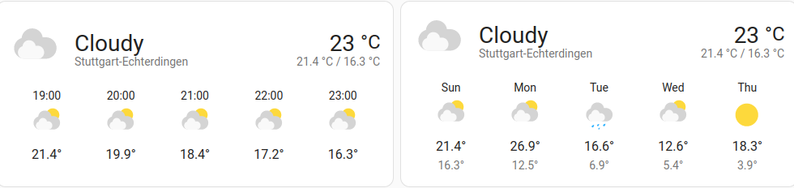

   

# Deutscher Wetterdienst (DWD) Integration for Home Assistant

- [Introduction](#introduction)
- [Main Features](#main-features)
- [Quick Setup](#quick-setup)
- [Questions & Answers](#questions--answers)
- [Bug Reports](#bug-reports)
- [References](#references)

## Introduction
This custom component for [Home Assistant](https://www.home-assistant.io/) integrates weather data (measurements and forecasts) from the [Deutscher Wetterdienst Open Data](https://www.dwd.de/DE/leistungen/opendata/opendata.html) server into Home Assistant via weather entities.

### Legal Information

**Deutscher Wetterdienst (DWD) is not affiliated in any way with this project.**

The conditions from Deutscher Wetterdienst (DWD) for using their data and accessing their servers apply.
- https://www.dwd.de/EN/service/copyright/copyright_artikel.html
- https://opendata.dwd.de/README.txt

[stations.md](stations.md) and [custom_components/dwd/stations.json](custom_components/dwd/stations.json) are generated from data from Deutscher Wetterdienst (DWD) with the Python script at [tools/generate_stations/generate_stations.py](tools/generate_stations/generate_stations.py).

## Main Features

- Current measurement data from the weather stations from https://opendata.dwd.de/weather/weather_reports/poi/ as state attributes of a weather entity.
  - condition
  - temperature
  - humidity
  - pressure
  - wind_bearing
  - wind_speed
  - visibility
- Hourly forecast data from the weather stations from https://opendata.dwd.de/weather/local_forecasts/mos/MOSMIX_L/single_stations/ in the forecast list of a weather entity.
  - datetime
  - condition
  - temperature
  - cloud_cover
  - precipitation
  - precipitation_probability
  - pressure
  - wind_bearing
  - wind_speed
- Daily forecast data calculated by the component from the hourly forecast data. This is the most tricky part. I have compared the result of this with what the official Warnwetter app displays and the results seems to be very close.
  - datetime
  - condition
  - temperature (the maximum temperature for the day)
  - templow (the minimum temperature for the day)
  - cloud_cover
  - precipitation
  - pressure
- Uses the [HTTP ETag](https://en.wikipedia.org/wiki/HTTP_ETag) mechanism to only download new data if the data has changed. This allows more frequent polling (currently about every 10 minutes) while still keeping the load low.
- Configuration via UI

 

Please notice that as usual, the "9 hours ago" in the screenshot refers to the last change of the state value of the entity, in this case when the condition (which is the state of weather entities) changed from "Party Cloudy" to "Sunny". Of course the values are updated much more often, but that's not reflected there. This has nothing to do with this integration but this is how it generally works, because only the state value is currently reflected in the entity history.

## Quick Setup

This quick setup guide is based on [My Home Assistant](https://my.home-assistant.io/) links and the [Home Assistant Community Store (HACS)](https://hacs.xyz). For more details and other setup methods, see [setup.md](setup.md).

As this integration is currently not part of Home Assistant Core, you have to download it first into your Home Assistant installation. To download it via HACS, click the following button to open the download page for this integration in HACS.

After a restart of Home Assistant, this integration is configurable by via "Add Integration" at "Devices & Services" like any core integration. Select "Deutscher Wetterdienst" and follow the instructions.

To get there in one click, use this button:

This adds one device and two entities (one with hourly forecast and one with daily forceast) for the selected station. To add more stations, just repeat the "Add Integration" step.

## Questions & Answers

If you have questions, they might already be answered at [questions_and_answers.md](./questions_and_answers.md).

## Bug Reports

It's always worth reporting bugs, if they haven't been reported yet and after having at look at [Questions & Answers](#questions--answers).

When reporting a bug, please follow these guidelines.

### Issues with Measurements
For issues with measurement data (current condition, current temperature, ...), please include the following items in your bug report.
- Always include the station ID.
- When the problem occurs, go to the Developer Tools and copy immediately the state value + all state attributes (YAML) of entity where the issue occurs. You could skip the forecast part, but to be safe, just copy the whole YAML.
- When the problem occurs, download immediately `https://opendata.dwd.de/weather/weather_reports/poi/{station_id}-BEOB.csv`. Replace `{station_id}` with your actual station ID. If your station ID has less than 5 characters, it has to be padded with trailing underscores, so e.g. "A191" becomes "A191_" here.

### Issues with Hourly Forecasts
For issues with hourly forecasts (i.e. the forecasts of the entity ending with "\_hourly"), please include the following items in your bug report.
- Always include the station ID.
- When the problem occurs, go to the Developer Tools and copy immediately all state attributes (YAML) of the hourly entity (the entity ending with "\_hourly").
- When the problem occurs, download immediately `https://opendata.dwd.de/weather/local_forecasts/mos/MOSMIX_L/single_stations/{station_id}/kml/MOSMIX_L_LATEST_{station_id}.kmz`. Replace `{station_id}` with your actual station ID. No padding needed here.

### Issues with Daily Forecasts
For issues with daily forecasts (i.e. the forecasts of the entity ending with "\_daily"), please include the following items in your bug report.
- Always include the station ID.
- When the problem occurs, go to the Developer Tools and copy immediately all state attributes (YAML) of the hourly entity (the entity ending with "\_hourly"). This is important, because the daily forecasts are calculated from hourly forecasts.
- When the problem occurs, go to the Developer Tools and copy immediately all state attributes (YAML) of the daily entity (the entity ending with "\_daily").
- When the problem occurs, download immediately `https://opendata.dwd.de/weather/local_forecasts/mos/MOSMIX_L/single_stations/{station_id}/kml/MOSMIX_L_LATEST_{station_id}.kmz`. Replace `{station_id}` with your actual station ID. No padding needed here.

## References
Unfortunately, most of the following documentation is only available in German.
### General
- [Deutscher Wetterdienst Open Data.](https://www.dwd.de/DE/leistungen/opendata/opendata.html)
- [List of documents related to Deutscher Wetterdienst Open Data](https://www.dwd.de/DE/leistungen/opendata/hilfe.html?nn=16102&lsbId=625220), e.g. documents that describe the various file formats. The most relevant ones used during development of this component are listed below.
### Measurements
- [Description of the codes in the present_weather column of the weather reports.](https://www.dwd.de/DE/leistungen/opendata/help/schluessel_datenformate/csv/poi_present_weather_zuordnung_pdf.pdf)
### Forecasts
- [Explanation of the elements used in the MOSMIX forecast KML files.](https://opendata.dwd.de/weather/lib/MetElementDefinition.xml)
- [Explanation of the weather codes (ww, ww3, WPc11, WPc31, WPc61, WPcd1, WPch1 and W1W2) used in the MOSMIX forecast KML files.](https://www.dwd.de/DE/leistungen/opendata/help/schluessel_datenformate/kml/mosmix_element_weather_xls.xlsx)
- [Binary Codes (BUFR).](https://www.dwd.de/DE/leistungen/pbfb_verlag_vub/pdf_einzelbaende/vub_2_binaer_barrierefrei.pdf) Actually, this should not be so much relevant, because everything should be covered by the previous documents, but there is some interesting overlap with the table "Aktuelles Wetter" on page 229 of this document.
- [General explanation of forecast symbols.](https://www.dwd.de/DE/fachnutzer/landwirtschaft/dokumentationen/agrowetter/VHS_Elemente_Wettersymbole.pdf) This doesn't explain the data format, but it is still quite interesting, because it shows the relations of the symbols to other data like cloud coverage and precipitation.
### Station Lists
For more information about stations see also [stations.md](stations.md).
- [General station list](https://rcc.dwd.de/DE/leistungen/klimadatendeutschland/stationsliste.html)
- [Station list with stations providing MOSMIX forecasts.](https://www.dwd.de/DE/leistungen/met_verfahren_mosmix/mosmix_stationskatalog.cfg)
