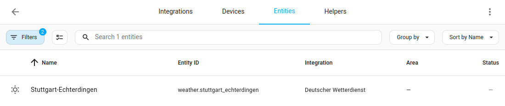

     
 

# Migration to New Weather Entity and Forecasts

This page is for people running this integration already. If you are new, please start at [README.md](./README.md).

With release 2023.8, Home Assistant has switched to a new mechanism how weather forecasts are provided. Before that, weather forecasts were provided via a state attribute of the weather entities, and the weather entities for each station needed to be duplicated to provide both hourly and daily forecasts.

Since Home Assistant 2023.8, all forecasts are provdided by a single entity (per station) and are retrieved by the [weather.get_forecasts service](https://www.home-assistant.io/integrations/weather/#service-weatherget_forecasts).

Currently, this integration provides both mechnisms in parallel via three different entities, the old ones with the `_daily` and `_hourly` suffix (disabled by default for new stations), and the new one without suffix, see screenshot below. But as the old mechism is deprecated by Home Assistant, it will eventually go away, [probably around Home Assistant 2024.3](https://developers.home-assistant.io/blog/2023/08/07/weather_entity_forecast_types/). So you should migrate to the new entities and the new mechanism now.

If you only use the built-in Weather Forecard Card from Home Assistant, the migration is usually as easy as removing the `_daily` or `_hourly` suffix from the Entity ID in the configuration of the Weather Forecast Card and selecting the desired forecast type (daily or hourly).

You should also disable the daily and hourly entities afterwards to make sure you don't use them any more.

If you use the forecasts from the state attribute in a template sensor or automation, or if you are using a third party weather card that has not been adapted yet, there is a bit more work to do. For that, you may find these resources helpful:

- [Examples](https://www.home-assistant.io/integrations/weather/#examples) in the Home Assistant documentation.
- [Questions & Answers](./questions_and_answers.md) for this integration which also include a complete example for a template sensor that can be used as a drop-in replacement for third party weather cards that have not be adapted yet.
