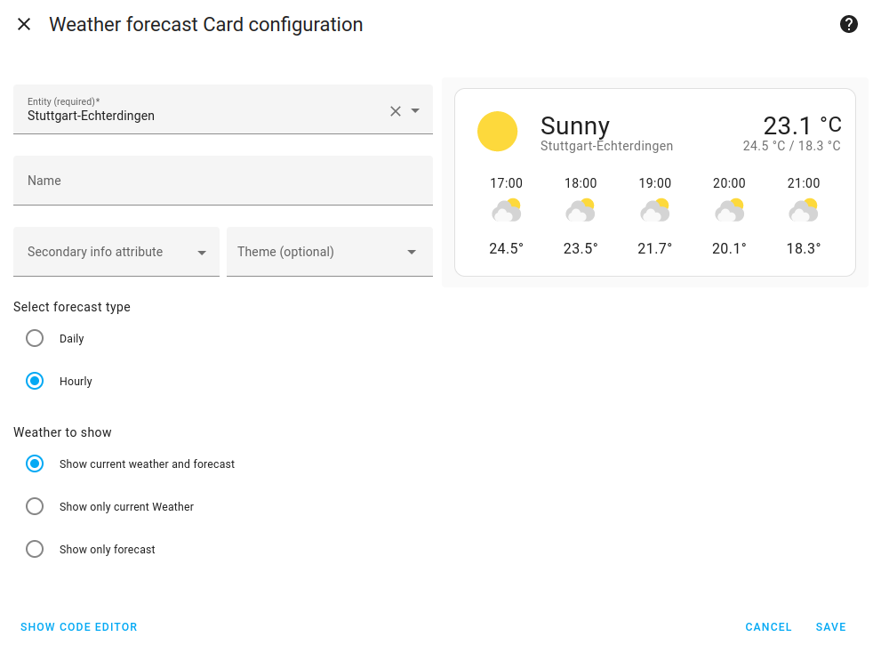

[](https://github.com/hg1337/homeassistant-dwd/releases) [](https://github.com/hg1337/homeassistant-dwd/actions/workflows/hassfest.yml) [](https://github.com/hg1337/homeassistant-dwd/blob/main/LICENSE) [](https://www.buymeacoffee.com/hg1337)  
[](https://my.home-assistant.io/redirect/hacs_repository/?owner=hg1337&repository=homeassistant-dwd&category=integration) [](https://my.home-assistant.io/redirect/config_flow_start/?domain=dwd)

# Deutscher Wetterdienst (DWD) Setup

Please read [README.md](./README.md) first, if you haven't already.

- [Download](#download)
    - [Download via HACS](#download-via-hacs)
    - [Manual Download](#manual-download)
- [Configuration](#configuration)

## Download

As this integration is currently not part of Home Assistant Core, you have to download it first into your Home Assistant installation. The recommended way is via the [Home Assistant Community Store (HACS)](https://hacs.xyz), because it makes updates easier, but of course you can also do it manually, if you don't want to use HACS.

### Download via HACS

The easiest way is by clicking on the following button. It will directly open the download page for this integration in HACS.

[](https://my.home-assistant.io/redirect/hacs_repository/?owner=hg1337&repository=homeassistant-dwd&category=integration)

If you don't want to use the My Home Assistant button or if it doesn't work in your setup, follow these steps:

1. Open "HACS" from the Home Assistant main menu.
2. Select "Integrations".
3. Select "Explore & Dowload Repositories".
4. Search for "Deutscher Wetterdienst (by hg1337)" and select it.  
  
There is another integration named "Deutscher Wetterdienst" available, that's not this one. However, feel free to try out both. ;)

Select "Download" and follow the instructions. To use the newly downloaded integration, you have to restart Home Assistant

### Manual Download

For manual download, you need access to the config folder of Home Assistant. This depends on how you have installed Home Assistant. If you are using the Home Assistant Operating System, you may e.g. use the "Samba share" or the "Terminal & SSH" add-on.

[](https://my.home-assistant.io/redirect/supervisor_store/)

These steps are based on the "Samba share" add-on, but other methods are quite similar.

1. Create a folder named "custom_components" within the config folder, if it doesn't already exist.
2. Optional: If you have Python installed and if you like, you may run [tools/generate_stations/generate_stations.py](tools/generate_stations/generate_stations.py) to update the station list. However, it shouldn't change too often, that's why it is "pre-compiled".
3. Copy the whole custom_components/dwd folder of this repository into the custom_components folder. I.e. your structure should in the end be /config/custom_components/dwd.  

4. Restart Home Assistant. If you see a warning "You are using a custom integration dwd which has not been tested by Home Assistant." (and no errors of course) in the log, everything went well.

## Configuration

To add the actual weather device and entities, just add a new instance of the "Deutscher Wetterdienst" integration:

[](https://my.home-assistant.io/redirect/config_flow_start/?domain=dwd)

If you don't want to use the My Home Assistant button or if it doesn't work in your setup, follow these steps:

1. Open "Settings" from the Home Assistant main menu.
2. Select "Devices & Services".
3. Select "Add Integration".
4. Search for "Deutscher Wetterdienst" and select it.  


Follow the instructions, select a different station or enter a custom one if needed. By default, the closest station that provides measurement as well as forcast data is preselected, if it is not more than 20 km away and if the difference in elevation is less than 500 m. Otherwise the closest available station is preselected.

After that, you should have one new device and three new weather entities for the selected station. By default, only the entity that provides all forecasts in one entity is enabled. If you still need the deprecated weather entities with daily and houry forecasts separately or via the old mechanism, you can still enable them for now, but you should really switch to the new entity now. You may repeat these steps if you want to add more stations.


You may use these entities with any component that supports weather entities, e.g. the standard Weather Forecast Card:



I really like the custom weather card at https://github.com/bramkragten/weather-card. I started using that a long time ago, because it shows more information and allows more customizations than the standard Weather Forecast Card.


The layout in the screenshot above was created using this configuration:

```yaml
type: horizontal-stack
cards:
  - type: custom:weather-card
    entity: weather.stuttgart_echterdingen
    current: true
    details: true
    forecast: false
  - type: custom:weather-card
    entity: weather.stuttgart_echterdingen
    current: false
    details: false
    forecast: true
    forecast_type: hourly
    hourly_forecast: true
    number_of_forecasts: '5'
  - type: custom:weather-card
    entity: weather.stuttgart_echterdingen
    current: false
    details: false
    forecast: true
    forecast_type: daily
    hourly_forecast: false
    number_of_forecasts: '5'
```
